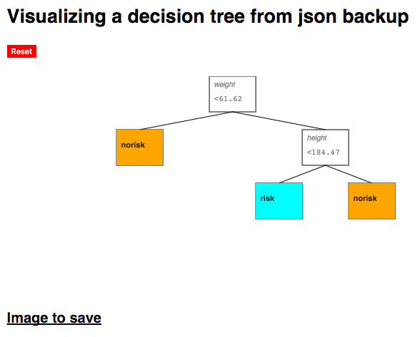

# Classification Decision Tree

This repository is a basic implementation of a decision tree algorithm for supervised classification learning. It implements a basic tree classifier, as well as a wrapper for tree bagging (bootstrap aggregating) and random forests.

## Dependencies

This implementation is built on `numpy` (<http://www.numpy.org/>), which is the only dependency required for running the classifier. The example script in `Examples.py` also requires `scikit-learn` (<http://scikit-learn.org/stable/index.html>) as it uses their `datasets` functionality to load example data. However, this package is not required for running the trees.

## Basic usage

### Single Tree

The `ClassificationTree` object can be created with two basic parameters: `depth_limit` (this restricts tree depth to prevent over-fitting) and `impurity` (which specifies the method for calculating impurity). The default impurity measure is _Gini impurity_, with the other option being _entropy_.

```python
from ClassTree import *
tree = ClassificationTree(depth_limit = 10, impurity = 'gini')
```

The public methods available with this object are `train()`, `predict()`, `evaluate()` and `cross_val()`. The tree can be learned with the `train` function, supplying the feature dataset `X` and class labels `y` (as numpy arrays):

```python
from ClassTree import *
tree = ClassificationTree(depth_limit = 10, impurity = 'gini')

tree.train(X, y)
```

Upon training, you can use the `predict` function to use the learned decision rules to classify an unlabeled dataset `X`. This function will raise an error if you call it before training. It returns a one-dimensional numpy array of class predictions.

```python
from ClassTree import *
tree = ClassificationTree(depth_limit = 10, impurity = 'gini')

tree.train(X, y)

predictions = tree.predict(X)
```

An alternative to the `predict` function is the `evaluate` function that runs the prediction and then evaluates the predictions based on supplied ground truth. The default scoring rule is the _F1-score_. Other options include simple _classification accuracy_ and the _Matthews correlation coefficient_. It returns a float.

```python
from ClassTree import *
tree = ClassificationTree(depth_limit = 10, impurity = 'gini')

tree.train(X, y)

predictions = tree.predict(X)

score_f1 = tree.evaluate(X, y)
score_accuracy = tree.evaluate(X, y, method = 'acc')
score_matt = tree.evaluate(X, y, method = 'matthews')
```

Instead of straight-forward training, you can also use cross-validation with the `cross_val` function. You can specify the number of "folds" (the number of validation trainings, defaults to 1) and the fraction of the supplied dataset that should be left out as validation set (defaults to 0.3), as well as the scoring method (defaults to F1). It returns an array of scores for each cross-validation fold.

```python
from ClassTree import *
tree = ClassificationTree(depth_limit = 10, impurity = 'gini')

cross_val_scores = tree.cross_val(X, y, split = 0.3, method = 'f1', folds = 5)
```

### Bagged Forest

The `TreeBagger` object implements a wrapper for growing a "forest" of "bagged" trees. _Bagging_ refers to _bootstrap aggregating_, where for a specified number of iterations, a new tree is grown with a bootstrapped subsample (with repetition) of the supplied dataset. The class `init`s with parameters that specify the number of trees (`n_trees`), the depth limit of each tree (`depth_limit`), the fraction of the dataset that should be used as a size of each bootstrap sample (`sample_fraction`), and the impurity measure to be used (`'gini'` or `'entropy'`).

```python
from ClassTreeBagging import *
bag = TreeBagger(n_trees=50, depth_limit = 10, sample_fraction=0.75, impurity = 'gini')
```

The public methods are the same as those for the simple tree. Bagged Forest classification also supports cross-validation now, with the same syntax as the simple tree.

### Random Forest

The `RandomForest` object implementes a wrapper for growing a random forest. The only difference with Bagged Forest is that the Random Forest algorithm also subsamples features during each iteration. This is preferred for a large number of features to prevent correlation and overfitting. Otherwise, the functionality and parameters of the class are the same as with `TreeBagger`, with the exception of cross-validation, which hasn't been implemented for Random Forests yet. 

The rule of thumb used in subsampling features is `sqrt(n)`. For low-dimensional datasets (`n<=10`), this is ignored and all features are used.

## JSON Import and Export

A trained tree (currently just a single tree, not a forest) can be saved as a JSON file. This is done with the `to_json()` function of a `ClassificationTree` instance. It takes one parameter: `filename`. Which is a filename/path to the file where to save the json.

Upon saving the JSON, you can rebuild a tree from a valid JSON file with the `from_json()` function, which also takes `filename` as a parameter that specifies the path to the saved JSON.

This functionality lets you backup your trained model for reuse and/or to use the trained tree structure for visualization.

## JSON visualization

Having exported a trained tree as JSON, you can use the barebones HTML and Javascript code in `tree_viz_js` to visualize this tree. After supplying a link/path to the JSON file, along with feature names and class labels, the script will draw a structure of the tree. Each node will show the name of the splitting feature, together with the decision threshold, if it is a decision node. Terminal nodes will show the assigned class labels.

A demo of this visualization can be found live here at my Github Page: <metjush.github.io/tree_viz_js>.



## Helpful resources

The following documents really helped in implementing the algorithm:

[Decision Tree Learning Wikipedia page](https://en.wikipedia.org/wiki/Decision_tree_learning)

[The ID3 Wikipedia page](https://en.wikipedia.org/wiki/ID3_algorithm)

["Classification: Basic Concepts, Decision Trees, and Model Evaluation" from University of Minnesota](http://www-users.cs.umn.edu/~kumar/dmbook/ch4.pdf)


